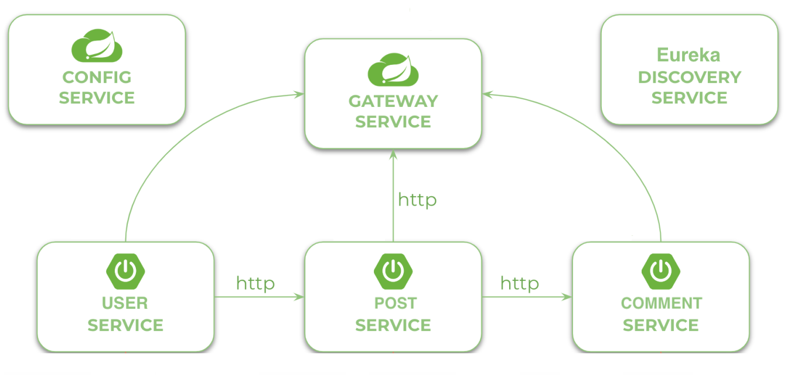

## A simple Blog App

I built a simple blog app that also demostrate microservice orchestration for a simple estore checkout app using a gateway configuration, a config server, and a discovery server.

## Usecase



## Components

1. **Config Server** : Centralizes configuration for all microservices.
2. **Discovery Server** : Manages the registration and discovery of microservices.
3. **API Gateway** : Routes requests to appropriate microservices and provides load balancing, authentication, and other gateway functionalities.
4. **User Service** : Separate services for user management. Manages user registration and authentication.
5. **Post Service** : Separate services for post management. Manages blog posts, including creation, retrieval and deletion.
6. **Comment Service** : Separate services for comment management.
7. **Authorization Service** : Separate services responsible for handling authentication and issuing tokens. 

## Features

1. Landing at home page - All users (including unregistered) can view all posts and comments.
2. Logged in users (Authenticated users) can add new posts, view only their own posts, edit or delete them (CRUD functionality).
3. Users can write comments to particular posted by themselves or other users.
4. Basic validation for creating new posts: body must not be empty and title must have length of 7 by default and other.
5. Spring Security authentication and authorization rules ensures that users only able to edit or delete their own posts.
6. Front-end made using Thymeleaf templates.

## Endpoints

# User Service:
Endpoints:
POST /users/register: Register a new user
POST /users/login: Authenticate a user
GET /users/{id}: Get user profile information

# Post Service:
Endpoints:
POST /posts: Create a new blog post
GET /posts: Get all blog posts
GET /posts/{id}: Get a specific blog post
DELETE /posts/{id}: Delete a blog post

# Comment Service:
Endpoints:
POST /posts/{postId}/comments: Add a comment to a blog post
GET /posts/{postId}/comments: Get all comments for a blog post
DELETE /comments/{id}: Delete a comment

## Technologies Used

- Java
- Spring Boot
- Spring Data JPA
- Spring Security
- Thymeleaf
- MySQL
- Maven
- Docker

### Installation
1. **Clone the repository**:
```bash
   git clone https://github.com/your-username/simple-blog-app.git
   cd simple-blog-app

2. **Run Docker file**:
```bash
   Docker file run 

