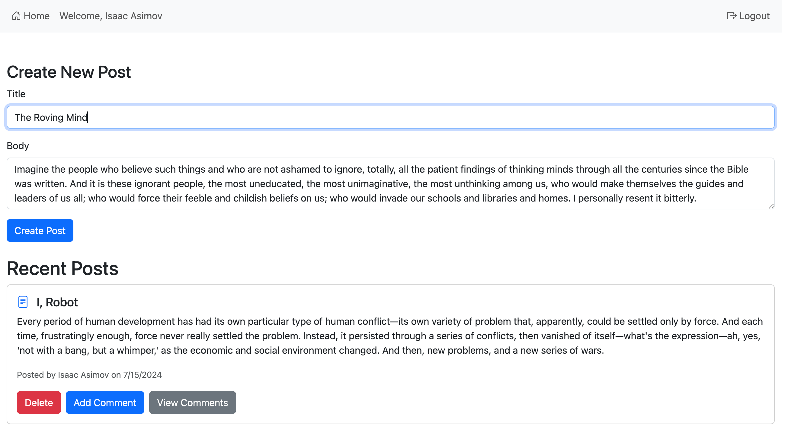

# Blog Application: Microservice Orchestration

This is a simple blog application demonstrating microservice orchestration using an API Gateway, a Configuration server, an Eureka Discovery server, and microservices for various functional components such as User Management, Posts Management, and Comments Management. React is used for the UI client.

## Architecture

## Features

1. **Home Page:** Displays a list of all posts by all users, ordered by the most recent.
2. **Signup Page:** Collects basic information to register a new user.
3. **Login Page:** Authenticates users via JWT token authentication, enabling them to comment on existing posts and create new posts.
4. **Add Post Page:** Allows users to create new posts.
5. **Add Comment Page:** Enables users to comment on posts posted by themselves or other users.
6. **Content Management:** Users can delete their own posts and comments.

## Screenshots

## Components

1. **Config Server:** Centralizes configuration for all microservices.
2. **Discovery Server:** Manages the registration and discovery of microservices.
3. **API Gateway:** Routes requests to appropriate microservices and provides load balancing, authentication, and other gateway functionalities.
4. **Authorization Service:** Handles authentication and token issuance.
5. **Post Service:** Manages blog posts, including creation, retrieval, and deletion.
6. **Comment Service:** Manages comments, including creation, retrieval, and deletion.

## JWT and Spring Security Architecture

1. **SecurityConfig:** Configures security settings for the application.
2. **JwtAuthenticationFilter:** Intercepts requests to validate JWT tokens.
3. **JwtUtil:** Handles creation, parsing, and validation of JWT tokens using the jjwt library.
4. **CustomUserDetailsService:** Loads user-specific data.
5. **AuthenticationController:** Provides tokens in responses for successful login requests.

## React Application Structure

1. **App Component (`App.js`):**
   - Root component
   - Sets up routing
   - Wraps the application with AuthProvider

2. **Authentication Context (`AuthContext.js`):**
   - Manages global authentication state
   - Provides login, logout, and signup functions
   - Checks and maintains authentication status

3. **API Services:**
   - `userAuthAPI.js`: Handles authentication-related API calls
   - `postAPI.js`: Manages post-related API calls
   - `commentAPI.js`: Handles comment-related API calls

4. **Components:**
   - `Navbar.js`: Navigation bar with conditional rendering based on auth status
   - `Home.js`: Main page, displays posts for authenticated users
   - `Login.js`: Handles user login
   - `SignUp.js`: Manages user registration
   - `PostList.js`: Displays list of posts with options to add/view comments
   - `AddComment.js`: Form for adding new comments
   - `ViewComments.js`: Displays comments for a specific post

## Database

- The application was developed using MySQL 8.4.0.
- Flyway is used to ensure that your database schema is automatically created and managed over time.

## Tech Stack

- Java
- Spring Boot
- Spring Data JPA
- Spring Security
- Spring MVC
- React
- MySQL
- Maven
- Docker

## Prerequisites

1. **Maven:** Ensure Maven is installed. Verify by running `mvn -v` in your terminal.
2. **JDK:** Ensure JDK is installed. Verify by running `java -version` in your terminal.
3. **Node.js and npm:** Ensure Node.js and npm are installed. Verify by running `node -v` and `npm -v` in your terminal.
4. **MySQL:** Ensure MySQL is installed and configured properly. Update the following properties in your `application.properties` files:
   - **Port:** Set the port number for MySQL.
   - **Username:** Specify your MySQL username.
   - **Password:** Provide the password associated with your MySQL username.

## Testing

Navigate to the backend service project directory and run the following command:

`mvn clean install && mvn spring-boot:run`

Start the services in the following order to ensure proper service discovery and configuration:

1. Discovery Service (Eureka )
2. Config Service
3. API Gateway Service
4. UserAuthService
5. PostService
6. CommentService

